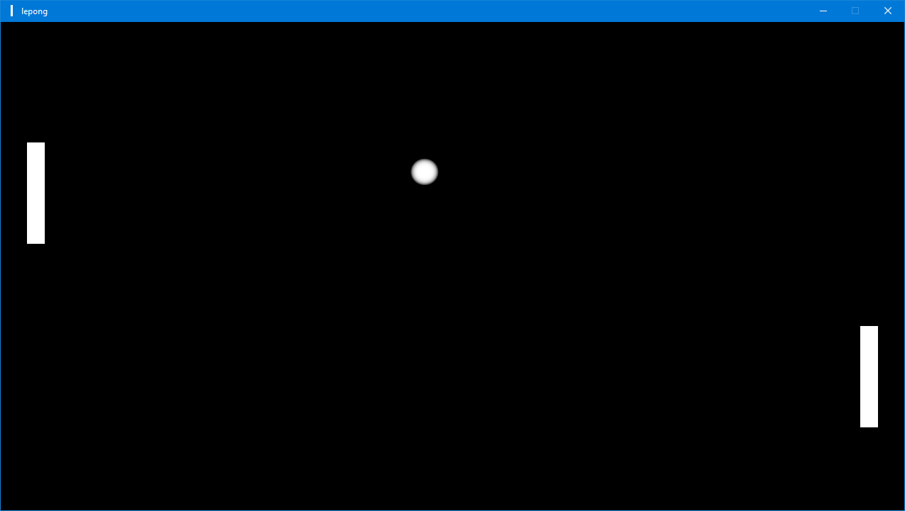

# lepong
A bare bones Pong clone made for Windows from scratch.

Press `Space` to play! The left paddle is controlled with `w` and `s` and the right paddle with the `up` and `down` arrows.



## Building
The following PowerShell code typically does the job. Or you can use the CMake GUI.
```
mkdir build
cd build
cmake ../
```

## Coding Style
When I started this project, I didn't really know what its coding style would be.
Right now it's pretty much a C interface with a C++ implementation and a few C++ wrappers.

The big thing with this C-ish design is that initialization and cleanup has to be done manually for every resource.
The major advantage is having full control over how data is managed, however it gets very tedious at times.
